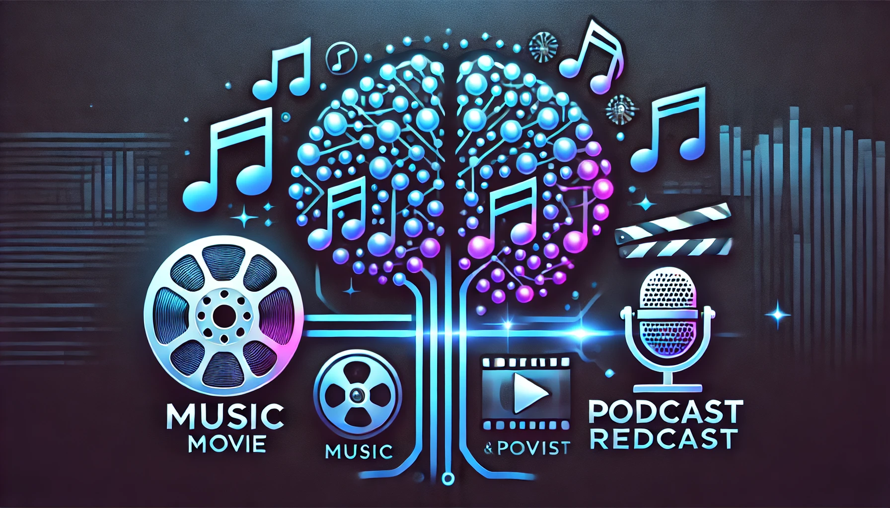

# RecoHub.AI  



## 🎬🎵🎙️ AI-Based Entertainment Recommendation Suite  

### Live Demo: [Click Here](#) *(Update with actual link)*

---

## 📌 Introduction  
Welcome to **RecoHub.AI**, an advanced AI-powered recommendation system designed to personalize your entertainment experience. Whether you're looking for **movies, music, or podcasts**, RecoHub.AI delivers tailored recommendations using cutting-edge machine learning techniques.

RecoHub.AI integrates **content-based filtering** and **vector similarity models** to understand user preferences and suggest relevant content.

---

## 📌 Features  
✅ **Movie Recommendation System** – Get recommendations based on your favorite movies.  
✅ **Music Recommendation System** – Find similar songs based on your listening history.  
✅ **Podcast Recommendation System** – Discover engaging podcasts in your preferred language and category.  
✅ **Interactive UI** – Powered by **Streamlit** for an easy-to-use experience.  
✅ **AI-Driven Insights** – Uses **TF-IDF Vectorization, Cosine Similarity, and Nearest Neighbors** for smart recommendations.  

---

## 📌 Project Navigation  
📂 **RecoHub.AI/**  
 ├── 📁 `models/` *(Trained ML models stored here)*  
 ├── 📁 `data/` *(Processed datasets for movies, music, and podcasts)*  
 ├── 📁 `images/` *(Screenshots and banners)*  
 ├── 📁 `src/` *(Main application logic & backend code)*  
 ├── 📄 `app.py` *(Streamlit UI for recommendations)*  
 ├── 📄 `README.md` *(This file!)*  

---

## 📌 Tools & Technologies Used  
- **Python** (Pandas, NumPy, Seaborn, Matplotlib)  
- **Machine Learning** (Scikit-Learn, Cosine Similarity, TF-IDF, Nearest Neighbors)  
- **Flask** (For API integration)  
- **Streamlit** (For Web UI)  
- **NeonDB (PostgreSQL)** (For user authentication & data storage)  
- **Requests API** (For fetching additional media details)  

---

## 📌 Setup Instructions  
1️⃣ Clone the repository:
```bash
 git clone https://github.com/yourusername/RecoHub.AI.git
```

2️⃣ Navigate to the project directory:
```bash
 cd RecoHub.AI
```

3️⃣ Install dependencies:
```bash
 pip install -r requirements.txt
```

4️⃣ Run the application:
```bash
 streamlit run app.py
```

---

## 📌 Key Models Used  
### 🎬 Movie Recommendation System  
🔹 **Model:** Content-based filtering with TF-IDF & Cosine Similarity  
🔹 **Dataset:** Movie titles, genres, descriptions, and ratings  
🔹 **Output Example:**  
  

### 🎵 Music Recommendation System  
🔹 **Model:** TF-IDF + Cosine Similarity with music metadata  
🔹 **Dataset:** Song names, artists, genres, user ratings  
🔹 **Output Example:**  
  

### 🎙️ Podcast Recommendation System  
🔹 **Model:** Nearest Neighbors with TF-IDF on podcast descriptions  
🔹 **Dataset:** Podcast titles, descriptions, categories, and languages  
🔹 **Output Example:**  
  

---

## 🚀 Future Enhancements  
✅ **Hybrid Recommendation (Content + Collaborative Filtering)**  
✅ **User Login & Personalized History Tracking**  
✅ **More Streaming Service Integrations**  

---

## 📌 Contact  
💬 Have suggestions or questions? Feel free to reach out!  
📧 Email: work.vinayakvathare@gmail.com  
🔗 LinkedIn: [Vinayak Vathare](https://www.linkedin.com/in/vinayak-vathare-4bb135279/)

---

**🚀 Ready to explore personalized entertainment? Try RecoHub.AI now!**  
